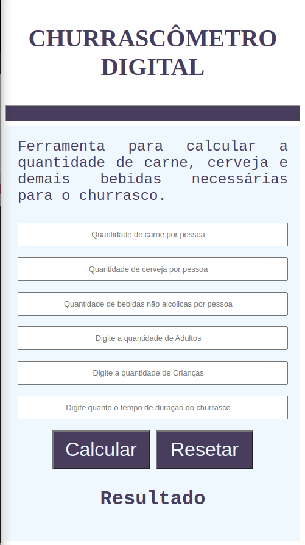

# CHURRASCÔMETRO 

## Programa para facilitar o cálculo dos ingredientes necessários para o churrasco, levando em conta a quantidade de pessoas, adultos ou crianças e o tempo de duração do evento.

  

     
    

